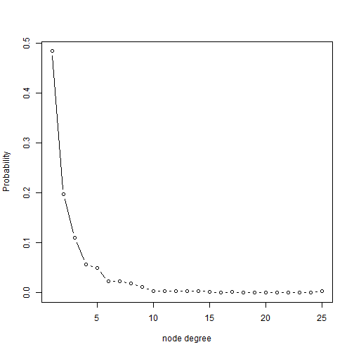
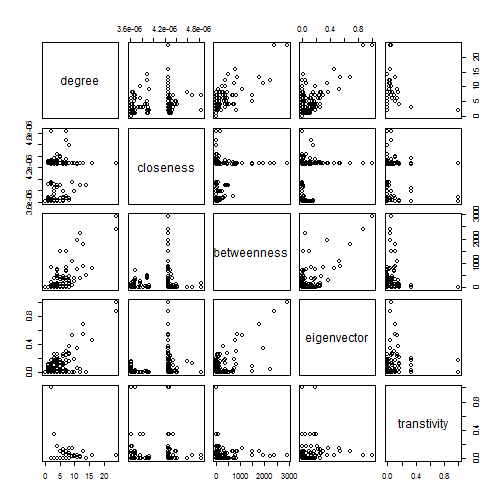
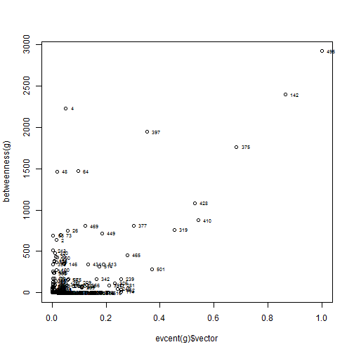
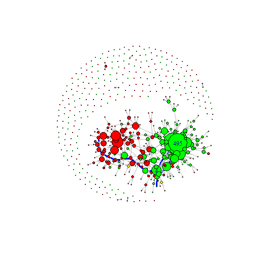

Describe the Network
========================================================
# http://horicky.blogspot.com/2012/04/basic-graph-analytics-using-igraph.html
# revised by chengjun wang @ Tencent 2014/04/16


```r
library(igraph)


################## generate graphs Create a directed graph
g = graph(c(1, 2, 2, 3, 2, 4, 2, 5), directed = TRUE)
g
```

```
## IGRAPH D--- 5 4 --
```

```r
plot(g)
```

 

```r

# Create a directed graph using adjacency matrix
m = matrix(runif(4 * 4), nrow = 4)
m
```

```
##        [,1]   [,2]   [,3]   [,4]
## [1,] 0.1820 0.6266 0.3579 0.1327
## [2,] 0.8087 0.5296 0.3611 0.2076
## [3,] 0.3557 0.6984 0.1290 0.9335
## [4,] 0.6963 0.8176 0.6508 0.5897
```

```r
g = graph.adjacency(m > mean(0.5))
g
```

```
## IGRAPH D--- 4 9 --
```

```r

plot(g, layout = layout.fruchterman.reingold)
```

 

```r

# Create a full graph
g1 = graph.full(4)
g1
```

```
## IGRAPH U--- 4 6 -- Full graph
## + attr: name (g/c), loops (g/x)
```

```r

# Create a ring graph
g2 = graph.ring(5)
g2
```

```
## IGRAPH U--- 5 5 -- Ring graph
## + attr: name (g/c), mutual (g/x), circular (g/x)
```

```r

# Combine 2 graphs
g = g1 %du% g2
g
```

```
## IGRAPH U--- 9 11 -- 
## + attr: name_1 (g/c), name_2 (g/c), loops (g/x), mutual (g/x),
##   circular (g/x)
```

```r
E(g)
```

```
## Edge sequence:
##            
## [1]  2 -- 1
## [2]  3 -- 1
## [3]  4 -- 1
## [4]  3 -- 2
## [5]  4 -- 2
## [6]  4 -- 3
## [7]  6 -- 5
## [8]  7 -- 6
## [9]  8 -- 7
## [10] 9 -- 8
## [11] 9 -- 5
```

```r
plot(g)
```

 

```r

g3 = graph.difference(g, graph(c(2, 1, 3, 1), directed = F))
E(g3)
```

```
## Edge sequence:
##           
## [1] 4 -- 1
## [2] 4 -- 2
## [3] 3 -- 2
## [4] 4 -- 3
## [5] 9 -- 5
## [6] 6 -- 5
## [7] 7 -- 6
## [8] 8 -- 7
## [9] 9 -- 8
```

```r


# Create a lattice
g1 = graph.lattice(c(3, 4, 2))
# Create a tree
g2 = graph.tree(12, children = 2)
plot(g1, layout = layout.fruchterman.reingold)
```

 

```r
plot(g2, layout = layout.reingold.tilford)
```

 

```r

# Generate random graph, fixed probability
g = erdos.renyi.game(20, 0.3)  # n nodes p probability of tie generating in graph g
plot(g, layout = layout.fruchterman.reingold, vertex.label = NA, vertex.size = 5)
```

 

```r

# Generate random graph, fixed number of arcs
g = erdos.renyi.game(20, 15, type = "gnm")  # n nodes m edges in graph g
plot(g)
```

 

```r
# Generate preferential attachment graph
g = barabasi.game(60, power = 1, zero.appeal = 1.3)
plot(g, layout = layout.fruchterman.reingold, vertex.label = NA, vertex.size = 5)
```

 

```r

######################### Minimum Spanning Tree Minimum Spanning Tree algorithm is to find a Tree
######################### that connect all the nodes within a connected graph while the sum of edges
######################### weight is minimum.

# Create the graph and assign random edge weights
set.seed(2014)
g = erdos.renyi.game(8, 0.35)
E(g)$weight = round(runif(length(E(g))), 2) * 50
E(g)$width = E(g)$weight/5  # set the width of edges
plot(g, layout = layout.fruchterman.reingold, edge.label = E(g)$weight)
```

 

```r
# Compute the minimum spanning tree
mst = minimum.spanning.tree(g, weights = E(g)$weight)
set.seed(2014)
plot(mst, layout = layout.reingold.tilford, edge.label = E(mst)$weight)
```

 

```r

# Plot the mst in the graph
eg = get.edgelist(g)
em = get.edgelist(mst)
eg = paste(eg[, 1], eg[, 2], sep = "--")
em = paste(em[, 1], em[, 2], sep = "--")
E(g)$color = "grey"
E(g)[match(em, eg)]$color = "red"
set.seed(2014)
plot(g, layout = layout.fruchterman.reingold, edge.label = E(g)$weight)
```

 

```r
######################### Minimum Spanning Tree


# Connected Component algorithms is to find the island of nodes that are
# interconnected with each other, in other words, one can traverse from one
# node to another one via a path.  Notice that connectivity is symmetric in
# undirected graph, it is not the necessary the case for directed graph (ie:
# it is possible that nodeA can reach nodeB, then nodeB cannot reach nodeA).
# Therefore in directed graph, there is a concept of 'strong' connectivity
# which means both nodes are considered connected only when it is reachable
# in both direction.  A 'weak' connectivity means nodes are connected

g = graph(c(1, 10, 2, 3, 2, 4, 1, 3, 3, 4, 4, 5, 5, 3, 4, 6, 6, 7, 7, 8, 8, 
    6, 9, 10, 10, 11, 11, 9))
# Nodes reachable from node4
subcomponent(g, 4, mode = "out")
```

```
## [1] 4 5 6 3 7 8
```

```r
# Nodes who can reach node4
subcomponent(g, 4, mode = "in")
```

```
## [1] 4 2 3 1 5
```

```r
clusters(g, mode = "weak")
```

```
## $membership
##  [1] 1 1 1 1 1 1 1 1 1 1 1
## 
## $csize
## [1] 11
## 
## $no
## [1] 1
```

```r


myc = clusters(g, mode = "strong")
myc
```

```
## $membership
##  [1] 2 1 4 4 4 5 5 5 3 3 3
## 
## $csize
## [1] 1 1 3 3 3
## 
## $no
## [1] 5
```

```r
col.num = max(unique(myc$membership))
mycolor = colors()[sample(100, col.num)]
V(g)$color = mycolor[myc$membership]
plot(g, layout = layout.fruchterman.reingold)
```

 

```r


# network diameter
d = get.diameter(g)
E(g, path = d)$color = "blue"

################## Shortest path 'Shortest Path is almost the most commonly used algorithm in
################## many scenarios, it aims to find the shortest path from nodeA to nodeB.  In
################## iGraph, it use 'breath-first search' if the graph is unweighted (ie:
################## weight is 1) and use Dijkstra's algo if the weights are positive,
################## otherwise it will use Bellman-Ford's algorithm for negatively weighted
################## edges.'

g = erdos.renyi.game(12, 0.25)
plot(g, layout = layout.fruchterman.reingold)
```

 

```r
pa = get.shortest.paths(g, 5, 9)[[1]]
pa = unlist(pa)

V(g)[pa]$color = "green"
E(g)$color = "grey"
E(g, path = pa)$color = "red"
E(g, path = pa)$width = 3
plot(g, layout = layout.fruchterman.reingold)
```

 

```r

################# Graph Statistics Create a random graph
set.seed(2004)
g = erdos.renyi.game(200, 0.01)
plot(g, layout = layout.fruchterman.reingold, vertex.label = NA, vertex.size = 3)
```

 

```r
# No of nodes
length(V(g))
```

```
## [1] 200
```

```r
# No of edges
length(E(g))
```

```
## [1] 180
```

```r
# Density (No of edges / possible edges)
graph.density(g)
```

```
## [1] 0.009045
```

```r
# Number of islands
clusters(g)$no
```

```
## [1] 41
```

```r
# Global cluster coefficient: (close triplets/all triplets)
transitivity(g, type = "global")
```

```
## [1] 0.01881
```

```r
# Edge connectivity, 0 since graph is disconnected
edge.connectivity(g)
```

```
## [1] 0
```

```r
# Same as graph adhesion
graph.adhesion(g)
```

```
## [1] 0
```

```r
# Diameter of the graph
diameter(g)
```

```
## [1] 18
```

```r
# Reciprocity of the graph
reciprocity(g)
```

```
## [1] 1
```

```r

# Diameter of the graph
diameter(g)
```

```
## [1] 18
```

```r

# Reciprocity of the graph
reciprocity(g)
```

```
## [1] 1
```

```r

degree.distribution(g)
```

```
## [1] 0.155 0.325 0.235 0.175 0.085 0.010 0.015
```

```r
plot(degree.distribution(g), type = "b", xlab = "node degree")
```

 

```r

# 1. Connectivity between two nodes measure the distinct paths with no
# shared edges between two nodes. (ie: how much edges need to be removed to
# disconnect them) 2. Shortest path between two nodes 3. Trust between two
# nodes (a function of number of distinct path and distance of each path)

# Create a random graph
set.seed(2014)
g = erdos.renyi.game(9, 0.5)
plot(g, layout = layout.fruchterman.reingold)
```

 

```r
# Compute the shortest path matrix
shortest.paths(g)
```

```
##       [,1] [,2] [,3] [,4] [,5] [,6] [,7] [,8] [,9]
##  [1,]    0    1    1    1    1    1    2    1    1
##  [2,]    1    0    1    1    1    2    1    2    2
##  [3,]    1    1    0    1    1    2    1    2    1
##  [4,]    1    1    1    0    2    1    2    1    2
##  [5,]    1    1    1    2    0    1    1    1    2
##  [6,]    1    2    2    1    1    0    1    1    2
##  [7,]    2    1    1    2    1    1    0    2    1
##  [8,]    1    2    2    1    1    1    2    0    2
##  [9,]    1    2    1    2    2    2    1    2    0
```

```r

# Compute the connectivity matrix
M = matrix(rep(0, 81), nrow = 9)
M
```

```
##       [,1] [,2] [,3] [,4] [,5] [,6] [,7] [,8] [,9]
##  [1,]    0    0    0    0    0    0    0    0    0
##  [2,]    0    0    0    0    0    0    0    0    0
##  [3,]    0    0    0    0    0    0    0    0    0
##  [4,]    0    0    0    0    0    0    0    0    0
##  [5,]    0    0    0    0    0    0    0    0    0
##  [6,]    0    0    0    0    0    0    0    0    0
##  [7,]    0    0    0    0    0    0    0    0    0
##  [8,]    0    0    0    0    0    0    0    0    0
##  [9,]    0    0    0    0    0    0    0    0    0
```

```r
for (i in 1:9) {
    for (j in 1:9) {
        if (i == j) {
            M[i, j] = -1
        } else {
            M[i, j] = edge.connectivity(g, i, j)
        }
    }
}
M
```

```
##       [,1] [,2] [,3] [,4] [,5] [,6] [,7] [,8] [,9]
##  [1,]   -1    5    6    5    6    5    5    4    3
##  [2,]    5   -1    5    5    5    5    5    4    3
##  [3,]    6    5   -1    5    6    5    5    4    3
##  [4,]    5    5    5   -1    5    5    5    4    3
##  [5,]    6    5    6    5   -1    5    5    4    3
##  [6,]    5    5    5    5    5   -1    5    4    3
##  [7,]    5    5    5    5    5    5   -1    4    3
##  [8,]    4    4    4    4    4    4    4   -1    3
##  [9,]    3    3    3    3    3    3    3    3   -1
```

```r

edge.connectivity(g, 1, 2)
```

```
## [1] 5
```

```r
################# Centrality Measures

# 1.Degree centrality gives a higher score to a node that has a high
# in/out-degree 2. Closeness centrality gives a higher score to a node that
# has short path distance to every other nodes 3. Betweenness centrality
# gives a higher score to a node that sits on many shortest path of other
# node pairs 4. Eigenvector centrality gives a higher score to a node if it
# connects to many high score nodes 5. Local cluster coefficient measures
# how my neighbors are inter-connected with each other, which means the node
# becomes less important.

g1 = barabasi.game(100, directed = F)
g2 = barabasi.game(100, directed = F)
g = g1 %u% g2

# Degree
deg = degree(g)
# Closeness (inverse of average dist)
clo = closeness(g)

# Betweenness
bet = betweenness(g)

# Local cluster coefficient
tra = transitivity(g, type = "local")

# Eigenvector centrality
eig = evcent(g)$vector

net.cen = data.frame(degree = deg, closeness = clo, betweenness = bet, eigenvector = eig, 
    transtivity = tra)
plot(net.cen)
```

 

```r

lay = layout.fruchterman.reingold(g)
# Plot the eigevector and betweenness centrality
plot(evcent(g)$vector, betweenness(g))
text(evcent(g)$vector, betweenness(g), 0:100, cex = 0.6, pos = 4)
```

 

```r

V(g)[12]$color = "red"
V(g)[8]$color = "green"
plot(g, layout = lay, vertex.size = 8, vertex.label.cex = 0.6)
```

 


